# CS488 Final Project HongFei Huang (Fracture Simulation)
### The maximum late days(3) are used for this project.
 
 

## Desription  
In this project, I implemented a fracture simulation using the pre-fractured models generated upon existing ones using blender. The program can take a input point from mouse clicking and cast a ray to any direction. If the ray collides with the model, then regarding the magnitude of the force, the object will either stay intact or break under the force hit. The broken pieces can interact with each other upon breaking and bouncing, but they will become completely static after the stop criteria is reached, which is not very physically accurate(one of the compromises that I had to make). 

## How to run program
The program should be built/run on Windows 10/11 with a either Visual Studio 2019 or 2022. Any graphics card that come with OpenGL 4.6 should be able to run this program without any problems(tested across different Windows PCs). My apologies for not having a proper Makefile; my time to finish the project was quite tight.

After opening the CollodeSimulation.sln, simply use the DEBUG/RELEASE mode to run the program. There are no command line parameters required.

In Main.cpp, you can easily uncomment the code piece to see the result of different objective demo and change the object(objModel) loaded by the program.

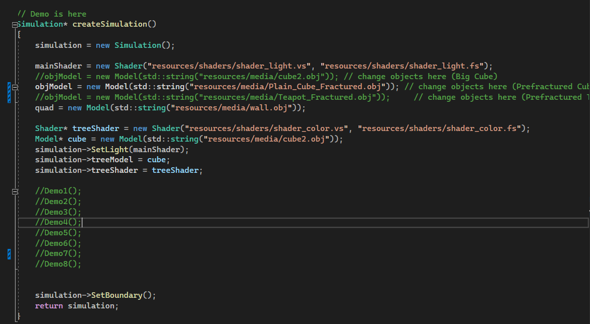  

## User Interface  
Here is the code for user interface, I think it's quite self-explanatory:  
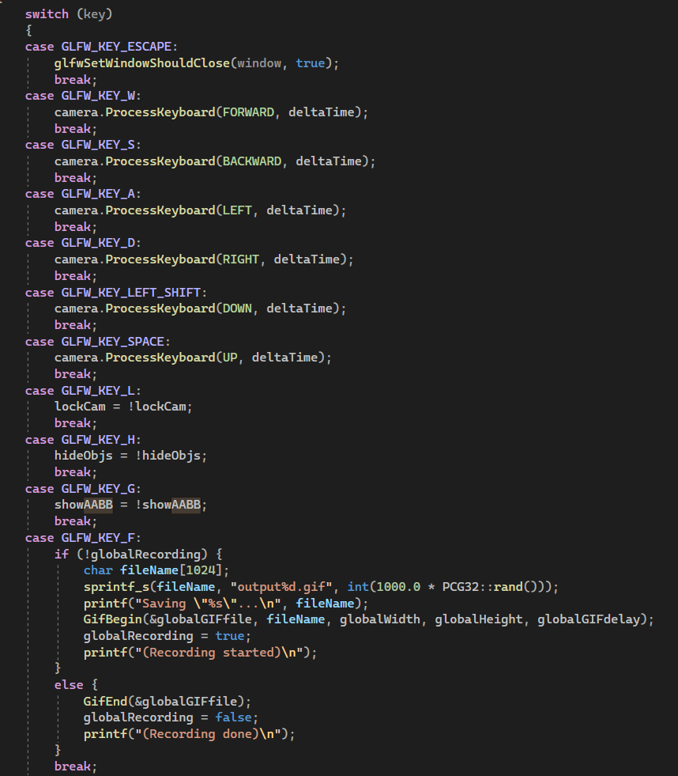  
WASD can be used for moving  
LEFT shift is used for descending and SPACE is used for ascending  
G can be used for drawing BVH leaf nodes (rigid bodies)  
H can be used for hiding all rigid bodies  
L can be used for locking camera movement  
F can be used for saving GIF, same way as the starter code. I didn't use it for demo screenshots because it doesn't show mouse location, but it does work  

## Implementation   

### ***Data Structures***  
**RigidBody**  
The representation of rigid body which contains object models, positions, axis-aligned bounding box (AABB) and information regarding dynamics such as linear velocity, angular velocity  
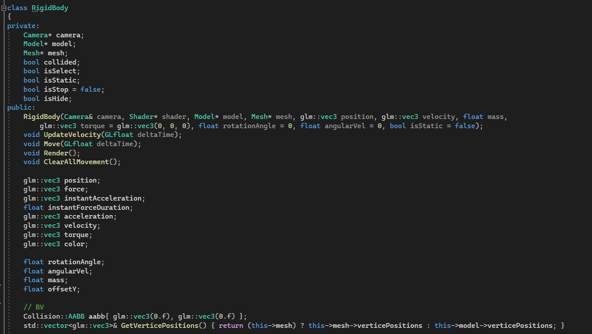    

**SAH-BVH**  
A top-down constructed Bounding Volume Hierarchy Tree that contains all objects. Each leaf node contains one rigid body. The split is chosen to minimize the total surface area of the two new volumes, as estimated by the Surface Area Heuristic (SAH). This data structure is crucial for both ray-AABB intersection, and AABB-AABB intersection, which are the two most important ways of collision in this project(This is an extra data structure I designed, which was not included in the proposal).  
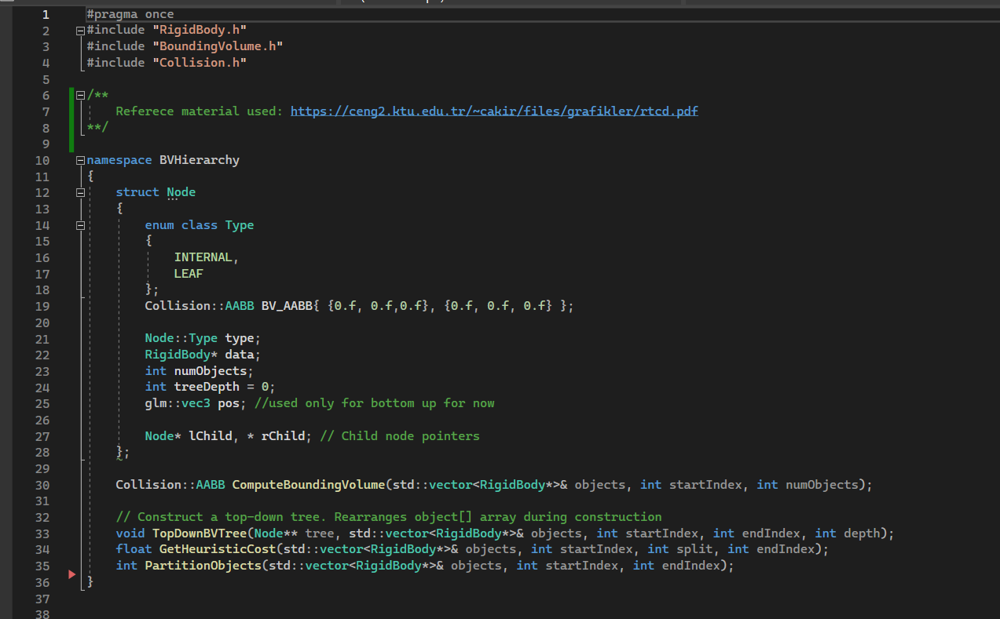    

**Bounding Volume**  
Simple AABB bounding volume was used in this project
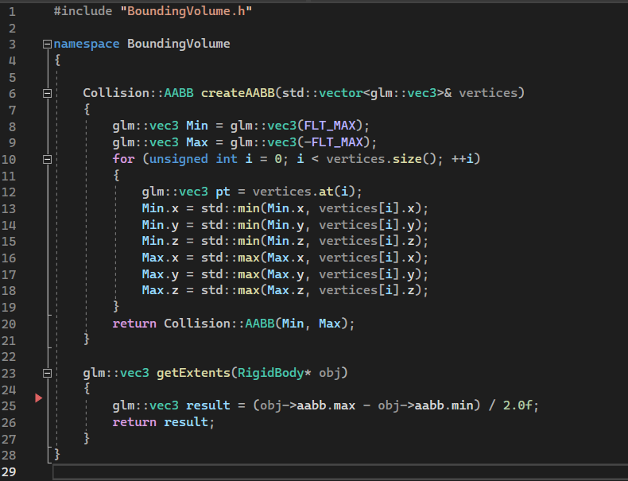    

**Colliders**  
There are only two colliders in this project: Ray and AABB bounding box
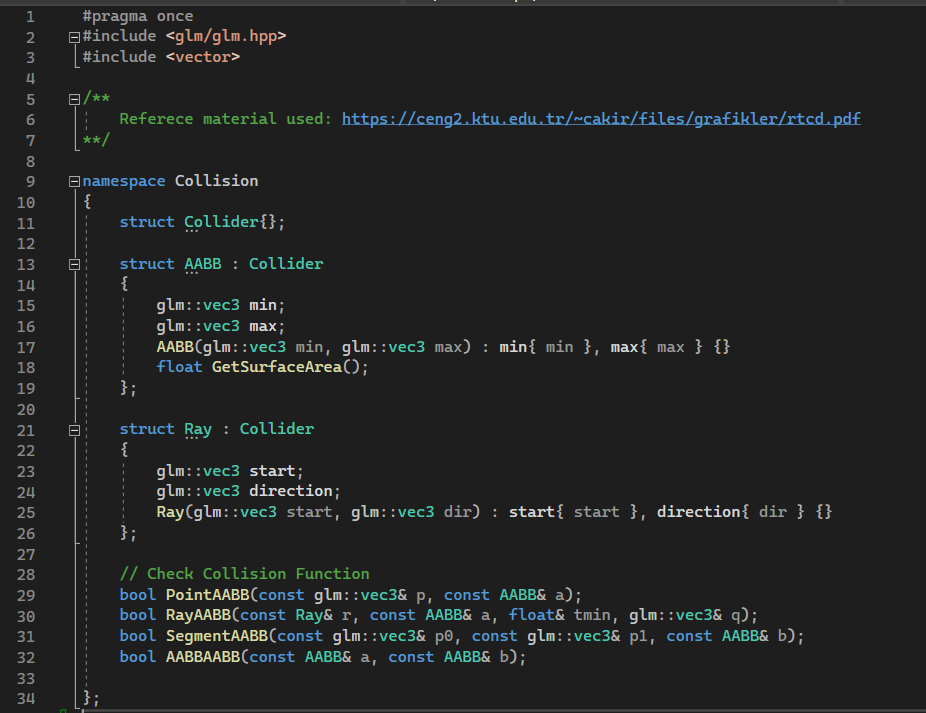   

**MouseRaycasting and RigidBodyPicker**  
They work together to complete the function of raycasting. MouseRaycasting generates the world coordinate ray direction produced by mouse click and RigidBodyPicker uses that ray to find the 
rigid body that's selected by the ray using Ray-AABB intersection.  
MouseRaycasting:  
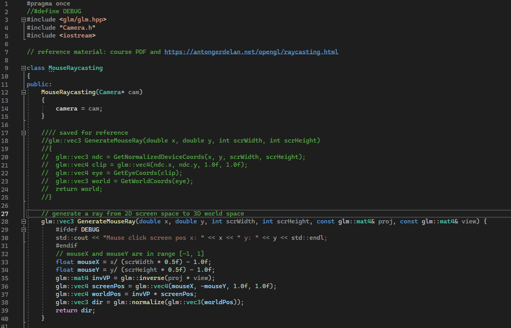  
Click() function in RigidBodyPicker that's responsible for rigid body selection:  
    

**Simulation**  
Simulation is arguably the most important data structure in this project. It contains all rigid body objects in the scene, renders all rigid bodies + bounding volumes for each rigid bodies(press 'G'if you want to see them), performs collision and updates the position of each rigid bodies, and builds/updates BVH and bounding volumes of each rigid bodies. The collision response of rigid bodies between the walls/floor is at the beginning of Simulation::UpdatePositions, and the collision response between two debris is inside Simulation::PerformCollision, which uses conservation of linear momentum to compute the linear transformation, and friction to compute rotation(I know the way I implement it might not be proper. This is one of the compromises I make due to the limited time I can work on this project). 
    

**Mesh loading, Model loading and Shader**  
In this project, model loading and rendering is not the major focus since it's more about physics based animation. So I've used existing code online for accomplishing these purposes.    
Source: https://learnopengl.com/code_viewer_gh.php?code=includes/learnopengl/shader.h  
Existing code used from this online source: **shader.h**    
Source: https://blog.csdn.net/manipu1a/article/details/85340045  
Existing code used from this online source: **mesh.h, model.h, shader_light.vs, shader_light.fs**   

Part of the implementations of SAH-BVH tree and collision detection are learned from this book:https://ceng2.ktu.edu.tr/~cakir/files/grafikler/rtcd.pdf   

### ***Global Variables***  
The only one that's relevant to the demonstration purpose is FPS_LIMIT(defined on the 2nd line in main.cpp). This macro defines the maximum frames per second.  

### ***Imperfections***  
BUGS: 
(1) Raycasting seems to be highlighting the wrong piece of the object sometimes. Initially, I thought it is due to the program not being able to identify which rigid body is closer to the ray if multiple hits are detected, but most of the time it's just a completely irrelevant rigid body being highted. I haven't figure out what's the root cause yet.  
(2) I have a FPS limiter implemented in main.cpp, and whenever the FPS is small(smaller than 30), some debris could penetrate the floor to "sink" below y = -1.0f. The reason why this happens is that when the FPS is small, delta time is large. Hence, the time segment between each check for collision is large, leading to a more possible case that the program didn't identify the collision. I haven't found an elegant way to resolve this yet, and I've tried pulling them up when it's detected to go beneath the floor but it doesn't look elegant at all. 
(3) You might have noticed that when a rigid body is about to come to a stop, it sometimes suddenly "teleports" to a position on the floor. It's actually more like a "hack" than a bug, since if I don't implement this "hack", the rigid body will somehow always retain a small velocity and moves indefinitely.   
Compromises I made for this project:  
(1) Like what  you can see in the demo gif/video, the way that I'm implementing the rigid body simulation is not quite proper. I've only used ray-aabb and aabb-aabb intersection for collision detection, meaning that it's not accurate, since aabb is merely a bounding box. The collision of aabb bounding box doesn't necessarily lead to the collision between two objects. Narrow phase collision detection is not completed.   
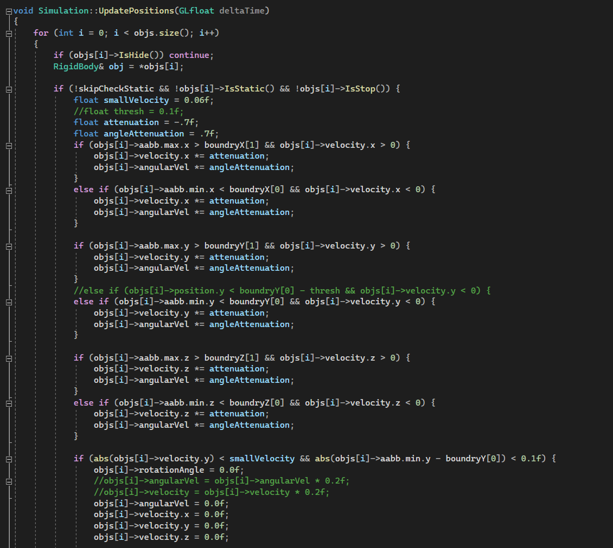   
(collision between rigid body and the wall, I simply added attenuation factor to velocity to make it "bounce back")  
(2) Since the narrow phase collision detection is not completed, an accurate hit point between two objects cannot be obtained. You might observe that two objects suddenly pull away from each other even if they are not "actually colliding".  
(3) Despite the outcome of demo8 looks somewhat presentable, but if you look into my code, you will find some places that I have to hard-code some value in order for the outcome to look reasonable. I think it's mainly due to the fact that a precise hitpoint cannot be obtained with my implementation.  
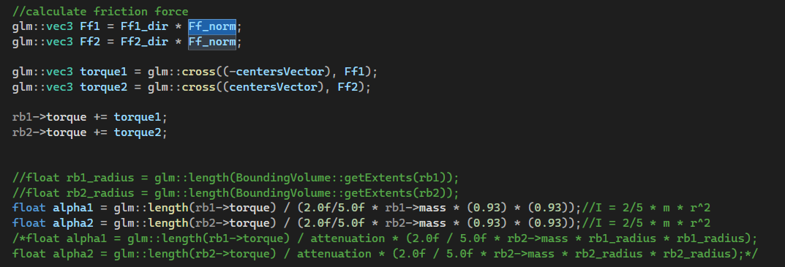   
(One of the example can be, when handling the collision between debris and updating their angular velocity using inertia in "Simulation::PerformCollision" , the radius has to be hard-coded to a number that's around 0.95 for it to work properly)    
(3) In the proposal, I state that I will be doing the coloring down to triangle level for objective 1,2 and 3, but I ended up simply using ray-aabb intersection to select and object and then color the rigid body, instead of doing ray-triangle intersection to color the triangle.

## Demo Screenshots  
**Demo 1**  
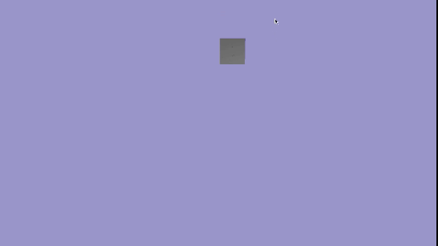  
**Demo 2**  
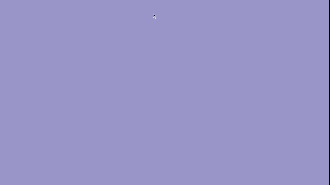  
**Demo 3**  
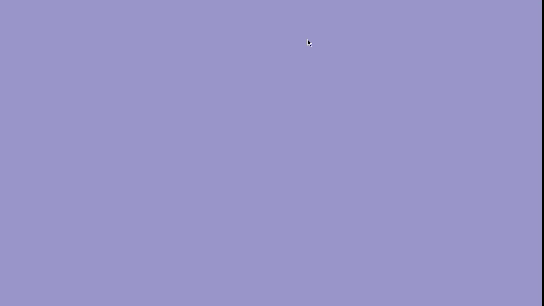  
**Demo 4**  
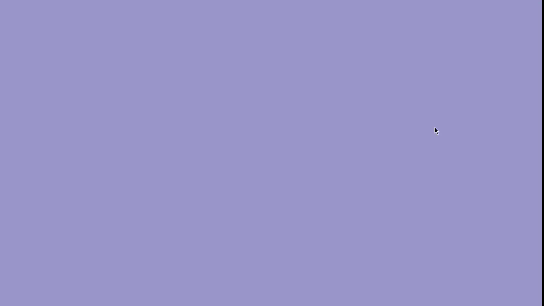  
**Demo 5**  
  
**Demo 6**  
  
**Demo 7**  
  
**Demo 8**  
  
  

## Objectives
1: Generate a ray from user’s mouse-clicking on the screen(Ray-casting). To verify the ray is correctly generated, load an object mesh into the screen and render the triangle hit by the ray as red.   
2: Implement proper velocity + position update for the rigid body simulation on objects. Given the gravity force and a constant angular velocity, the linear velocity needs to be correctly updated in each frame and the object should be observed spinning while falling down.  
3: Implement correct collision detection relative to the ground where y = -1.0f, and color the triangles in red when detected collisions. It should be observed that the object turns completely red during the fall.   
4: Implement correct collision response relative to the ”ground” where y = -1.0f with a penalty force approach. Linear velocity and angular velocity should both be correctly updated in order to simulate a realistic rigid body.   
5: Use the ”cell fracture” add-on in Blender to partition an object into debris. The different partitions will be separated by ”o”. Different partitions will be correctly identified and highlighted with independent colours to demonstrate that triangles have been grouped correctly.    
6: The pieces will be ”adhered” as a single object, meaning that they should behave like a single rigid body object before the breaking criteria is met(force not strong enough). Forces with various directions and magnitudes will be applied to the object to check if the rigid body simulation performs correctly.   
7: Implement interactions between debris so that they will collide not only with the ground, but also with each other. The first step is to detect collision between debris. Octree or Uniform grid screen partition might be a great solution for such a task. In this objective, when a collision is detected, colour the collided objects with distinctive colours and go 1 time step further to verify the collision.   
8: Implement correct responses between debris. The penalty method will be used to resolve the collision. It doesn’t have to be 100% physically accurate but needs to look fairly realistic   

## Final Thoughts  
To be honest, I'm not quite happy about how this project looks like. The reason why I was not using the starter code is because I want to get some hand-on experiences on OpenGL, and I was pretty confident at the beginning that it wouldn't take too much time to rebuild the interfaces/tools we already have, but I was wrong; I ended up investing quite a lot of time on them and my tight schedule for other courses really didn't leave me much time for a proper implementation of rigid body simulation. So as I result, I was using way too many "hacks" and "janky approches" in the code in order to make the project look somewhat presentable(for example, only use the broad phase AABB bounding box to detect and determine collision and didn't use any narrow phase techniques). 

The manner in which I completed this project fell short of the expectations I had set for myself, and I'm certain it didn't meet yours either.  I want to apologize for this outcome, especially since I had previously sent an email to you all saying "I want to make this project as successful as possible". It appears I over-promised and under-delivered... 

With that said, although this project is a setback for me, but I'm confident in my ability to produce better work given more time, and I still want to learn more about Computer Graphics since it's such an interesting topic. I want to thank you all for your efforts in making this course so enjoyable.

