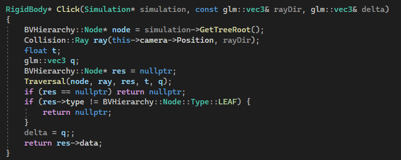
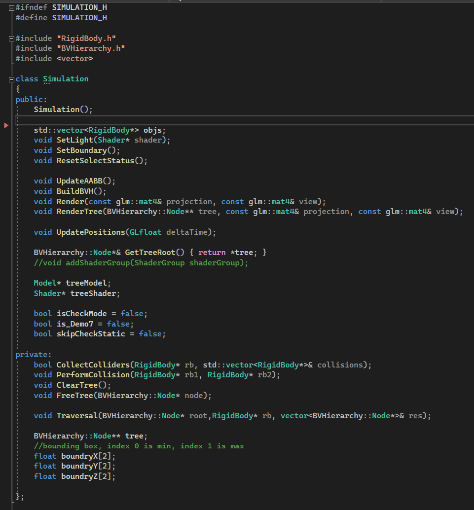

# CS488 Final Project HongFei Huang (Fracture Simulation)
### The maximum late days(3) are used for this project.
 
 

## Desription  
In this project, I implemented a fracure simulation using the prefractured models generated upon existing ones using blender. The program can take a input point from mouse clicking and cast a ray to any direction. If the ray collides with the model, then regarding the magnitude of the force, the object will either stay intact or break under the force hit. The broken pieces can interact with each other upon breaking and boucing, but they will become completely static after the stop criteria is reached, which is not very physically accurate(one of the comprimises that I had to make). 

## How to run program
The program should be built/run on Windows 10/11 with a either Visual Studio 2019 or 2022. Any graphics card that come with OpenGL 4.6 should be able to run this program without any problems(tested across different Windows PCs). My apologies for not having a proper Makefile; my time to finish the project was quite tight.

After opening the CollodeSimulation.sln, simply use the DEBUG/RELEASE mode to run the program. There no command line parameters required.

In Main.cpp, you can easily umcomment the code piece to see the result of different objective demo and change the object(objModel) loaded by the program.

  

## Implementation  

### Data Structures  
**RigidBody**  
The representation of rigid body which contains object models, positions, axis-aligned bounding box (AABB) and information regarding dynamics such as linear velocity, angular velocity  
    

**SAH-BVH**  
A top-down constructed Bounding Volume Hireharchy Tree that contains all objects. Each leaf node contains one rigid body. The split is chosen to minimize the total surface area of the two new volumes, as estimated by the Surface Area Heuristic (SAH). This data structure is crucial for both ray-AABB intersection, and AABB-AABB intersection, which are the two most important ways of collision in this project(This is an extra data structure I designed, which was not included in the proposal).  
    

**Bounding Volume**  
Simple AABB bounding volume was used in this project
    

**Colliders**  
There are only two colliders in this project: Ray and AABB bounding box
   

**MouseRaycasting and RigidBodyPicker**  
They work together to complete the function of raycasting. MouseRaycasting generates the world coordinate ray direction produced by mouse click and RigidBodyPicker uses that ray to find the 
rigid body that's selected by the ray using Ray-AABB intersection.  
MouseRaycasting:  
  
Click() function in RigidBodyPicker that's responsible for rigid body selection:  
    

**Simulation**  
Simulation is arguably the most important data structer in this project. It contains all rigid body objects in the scene, renders all rigid bodies + bounding volumes for each rigid bodies(press 'G'if you want to see them), performs collision and updates the position of each rigid bodies, and builds/updates BVH and bounding volumes of each rigid bodies.  
    

**Mesh loading, Model loading and Shader**  
In this project, model loading and rendering is not the major focus since it's more about physics based animation. So I've used existing code online for accomplishing these purposes.    
Source: https://learnopengl.com/code_viewer_gh.php?code=includes/learnopengl/shader.h  
Existing code used from this online source: **shader.h**    
Source: https://blog.csdn.net/manipu1a/article/details/85340045  
Existing code used from this online source: **mesh.h, model.h, shader_light.vs, shader_light.fs**   

## User Interface  
Here is the code for user interface, I think it's quite self-explainatory:  

## Demo Screenshots  
**Demo 1**  
  
**Demo 2**  
  
**Demo 3**  
  
**Demo 4**  
  
**Demo 5**  
  
**Demo 6**  
  
**Demo 7**  
  
**Demo 8**  
  
  

## Final Thoughts  
To be honest, I'm not quite happy about how this project looks like. The reason why I was not using the starter code is because I want to get some hand-on experiences on OpenGL, and I was pretty confident at the beginning that it wouldn't take too much time to rebuild the interfaces/tools we already have, but I was wrong; I ended up investing quite a lot of time on them(especiall SAH-BVH) and my tight schedule for other courses really didn't leave me much time for a proper implementation of rigid body simulation. So as I result, I was using way too many "hacks" and "janky approches" in the code in order to make the project look somewhat presentable(for example, only use the broad phase AABB bounding box to detect and determine collision and didn't use any narrow phase techniques). 

The manner in which I completed this project fell short of the expectations I had set for myself, and I'm certain it didn't meet yours either.  I want to apologize for this outcome, especially since I had previously sent an email to you all saying "I want to make this project as successful as possible". It appears I over-promised and under-delivered... 

With that said, although this project is a setback for me, but I'm confident in my ability to produce better work given more time, and I still want to learn more about Computer Graphics since it's such an interesting topic. I want to thank you all for your efforts in making this course so enjoyable.

